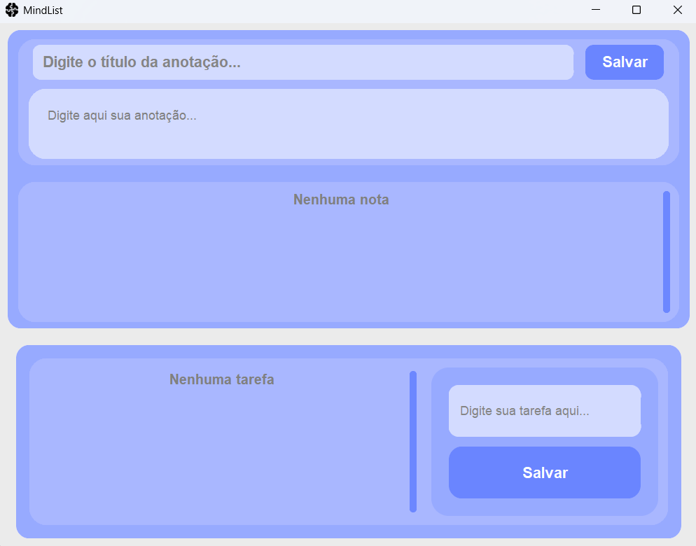
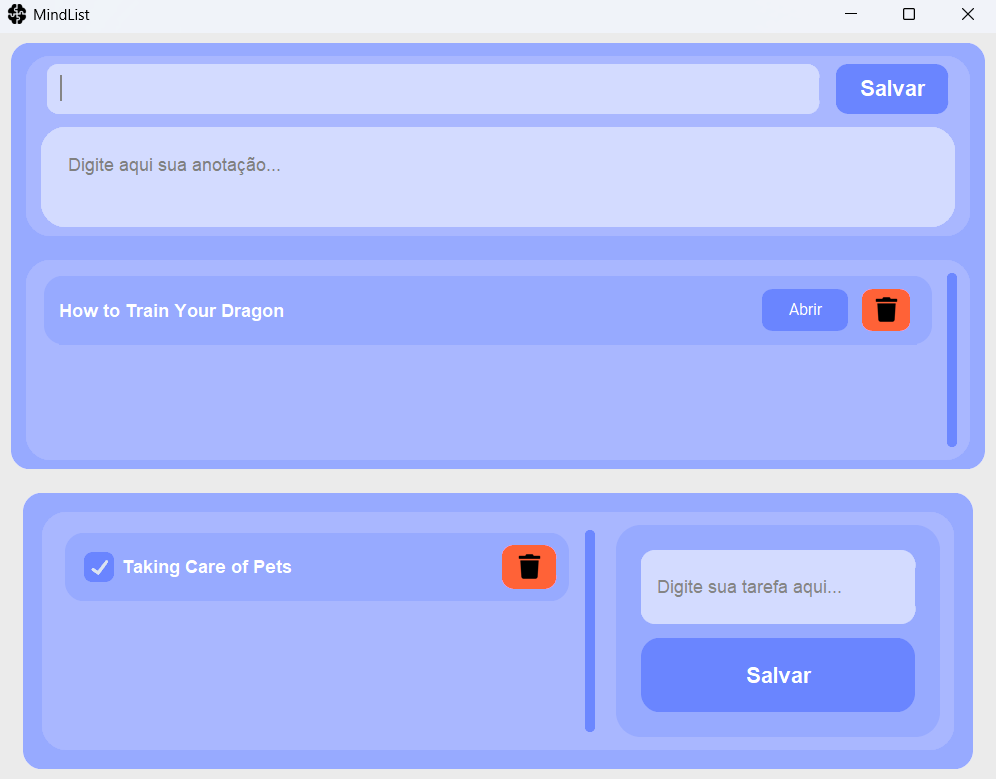
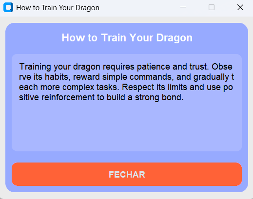

# MindList: Notebook and To-Do List

MindList is a desktop application developed in Python using CustomTkinter that allows you to manage notes and tasks in a practical and visual way.

My profiles: [LinkedIn](https://www.linkedin.com/in/hnrsous/) - [GitHub](https://github.com/hnrsous)

## Features:

• Create, view, and delete notes.
• Create, mark as completed, and delete tasks.
• User-friendly interface.

## Prerequisites:

Before running the project, you need to have the following installed:

• Python 3.10 or higher
• pip (Python package manager)

Libraries used:

• 'customtkinter'
• 'Pillow'

You can install them by running:

pip install customtkinter pillow

## Project Structure:

MindList/
│
├─ assets/
│ ├─ icons/
│
├─ ui/
│ ├─ notes_section.py
│ ├─ todo_section.py
│
├─ utils/
│ ├─ database.py
│
├─ main.py

## In the app you can:

• Add new notes and tasks.

• View notes by clicking "Open".

• Mark tasks as completed or delete them.

## App Screens:

Home Screen (no items)

Home Screen (with note and task created)

Note Popup

## Database:

The application uses SQLite (data.db) to store notes and tasks. The database is created automatically when the app starts.

## How to run?

1. Python

Recommended version: 3.10 or higher

You can download: https://www.python.org/downloads/

Check if installed:

python --version

2. Pip

Pip usually comes with Python.

Check with:

pip --version

3. Required Python Libraries

The project uses:

customtkinter → to create the modern interface

Pillow → to manipulate images (icons and thumbnails)

Install with:

pip install customtkinter pillow

4. Optional

SQLite does not need to be installed separately, as it is already included in Python.

5. After installing these, simply run:

python main.py

## Notes

• The app icon is located at assets/icons/mind.ico.

• The layout is fixed, but you can customize colors and sizes by editing the files in ui/.

[LinkedIn](https://www.linkedin.com/in/hnrsous/) - [GitHub](https://github.com/hnrsous)